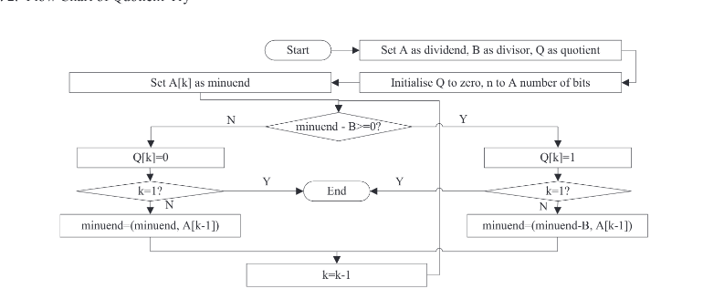
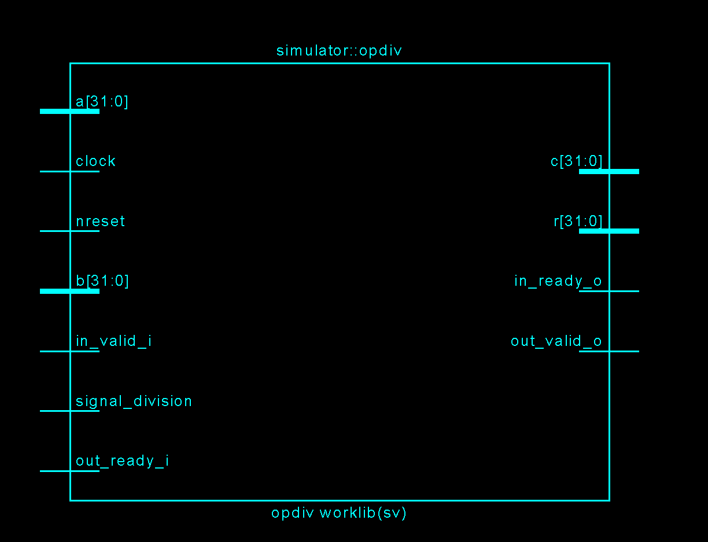
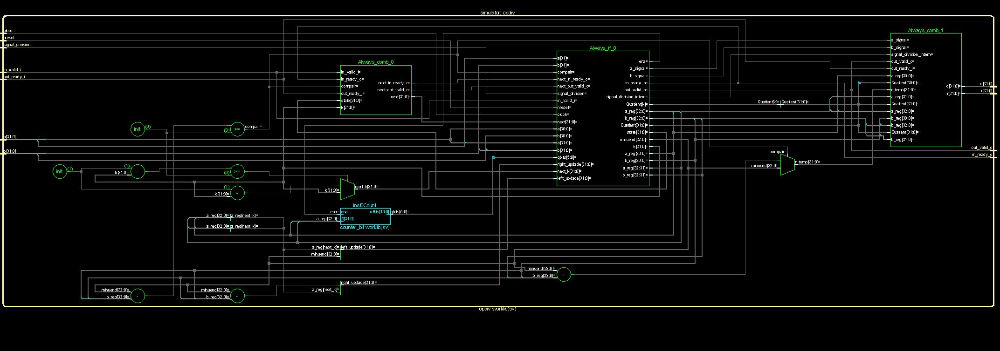
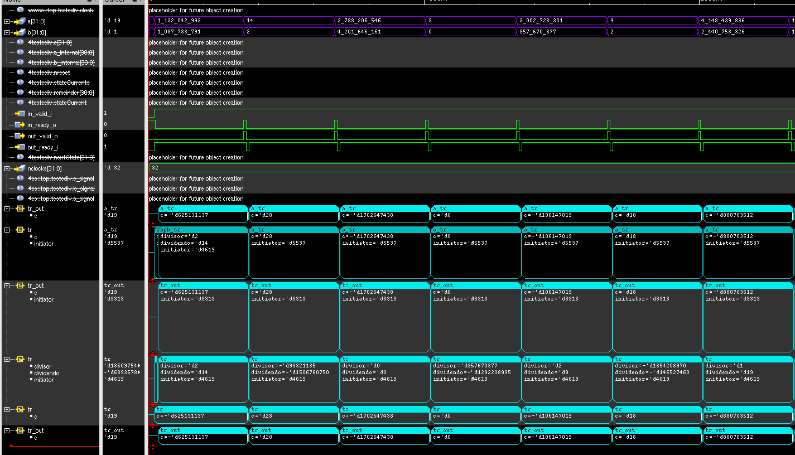
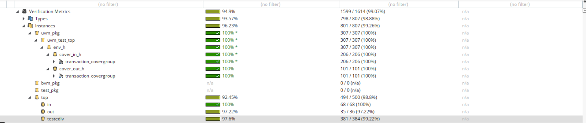

# Project Complect of Divider Optimization

This project focuses on the design of an Arithmetic Divider optimized for pipeline architecture, which handles all calculation exceptions without the need for explicit exception handling. The complete development flow includes Design, UVM Verification, and GDSII generation. The goal is to ensure an efficient and reliable arithmetic division operation within an integrated circuit (IC) design.

## Diagram

# Pins

## In
    ` clock   := Signal clock                                                ; 1bit `

    ` nreset  := Reset signal on the falling edge or active-low reset   ; 1bit `

    ` a           := Input operand A (signed integer value)
                ; 32bits signed `

    ` b           := Operando de entrada B (valor inteiro com sinal)
                ; 32bits signed `

    ` signal_division := Control signal for division or modulo operation
                    ; 1bit `

## Out  
    `  c           := ain operation result (signed integer value)
                ; 32bits signed `
    `  r           := Secondary result (signed integer value)
                ; 32bits signed `

## Handshake
` in_valid_i      := Indicates that the input data is valid
                    ; 1bit `

` out_ready_i     := Indicates that the module is ready to accept data (flow control)
                    ; 1bit `

` in_ready_o      := Indicates that the module is ready to accept data (flow control)
                    ; 1bit `

` out_valid_o     := Indicates that the output is valid and ready to be read
                    ; 1bit `

# Black Box (SimVision)

# Hierarchical Block Diagram (SimVision)

# UVM Verification (Xrun)
The verification environment for the DIV is composed of dedicated UVM Agents, which encapsulate the Driver and Monitor for the input and output interfaces. Additional customized test classes were also implemented. Table below summarizes the main components.

Each hardware block was submitted to exhaustive functional verification using a testbench built with the **Universal Verification Methodology (UVM)**. The primary goal was to validate the correct behavior of each module both **before and after integration** into the core, covering:

* Normal operation scenarios
* Exception handling
* CSR interaction
* All predefined constraints

---

### Testbench Components

| Component       | Main Function                                     | Implementation Highlights                                                          |
| --------------- | ------------------------------------------------- | ---------------------------------------------------------------------------------- |
| `driver_X_in`   | Injects input transactions (`tr_in`) into the DUT | Manages Ready/Valid handshake (`in_valid_i`, `in_ready_o`) ensuring correct timing |
| `monitor_X_in`  | Monitors input interface signals                  | Captures and timestamps input activity relative to clock                           |
| `driver_X_out`  | Controls the reception of output data             | Manages output handshake logic                                                     |
| `monitor_X_out` | Collects output data                              | Validates transmitted data and forwards info to the scoreboard                     |
| `refmod`        | Generates mathematical reference data             | Implements ISA-accurate models for division instructions                           |
| `coverage_in`   | Observes exercised input ranges                   | Covers extreme values (0, 1, Max) and range distributions                          |
| `coverage_out`  | Observes output distribution                      | Ensures zero, positive and negative outputs are generated                          |

---

## Coverage Metrics

Functional coverage ensured that all meaningful stimulus combinations were exercised. Coverage code was organized into:

* `coverage_in.sv` — input stimulus coverage
* `coverage_out.sv` — output result coverage

### Input Coverage (`coverage_in`)

* Exercises divisor and dividend across the complete range:

  * Extreme values: 0, 1, Max
  * Mid-range values

* **Cross Coverage (`cx_divisor_X_dividendo`)**:

  * Ensures all divisor/dividend combination pairs are hit

### Output Coverage (`coverage_out`)

Ensures quotient results include:

* Zero
* Positive
* Negative

---

## Tested Instructions

| Operation | Description        | Tests Performed                              |
| --------: | ------------------ | -------------------------------------------- |
|     `DIV` | Signed division    | Random tests; max/min values; divide-by-zero |
|    `DIVU` | Unsigned division  | Random tests; max/min values; divide-by-zero |
|     `REM` | Signed remainder   | Random tests; max/min values; divide-by-zero |
|    `REMU` | Unsigned remainder | Random tests; max/min values; divide-by-zero |

## Results

### Compare Results Ambient- Waves Form 

### Coverage

